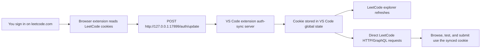

# LeetCode with Auth Sync

**VS Code extension:** [](https://marketplace.visualstudio.com/items?itemName=wilmtang.vscode-leetcode-auth-sync) [](https://marketplace.visualstudio.com/items?itemName=wilmtang.vscode-leetcode-auth-sync) [](https://marketplace.visualstudio.com/items?itemName=wilmtang.vscode-leetcode-auth-sync) [](https://marketplace.visualstudio.com/items?itemName=wilmtang.vscode-leetcode-auth-sync) [](https://marketplace.visualstudio.com/items?itemName=wilmtang.vscode-leetcode-auth-sync) [](https://github.com/wilmtang/vscode-leetcode/actions/workflows/build.yml) [](LICENSE)

**Open VSX extension:** [](https://open-vsx.org/extension/wilmtang/vscode-leetcode-auth-sync) [](https://open-vsx.org/extension/wilmtang/vscode-leetcode-auth-sync) [](https://open-vsx.org/extension/wilmtang/vscode-leetcode-auth-sync) [](https://open-vsx.org/extension/wilmtang/vscode-leetcode-auth-sync)

**Firefox extension:** [](https://addons.mozilla.org/en-US/firefox/addon/leetcode-vs-code-auth-sync/) [](https://addons.mozilla.org/en-US/firefox/addon/leetcode-vs-code-auth-sync/) [](https://addons.mozilla.org/en-US/firefox/addon/leetcode-vs-code-auth-sync/) [](https://addons.mozilla.org/en-US/firefox/addon/leetcode-vs-code-auth-sync/)

**Chrome extension:** [](https://chromewebstore.google.com/detail/leetcode-vs-code-auth-syn/elbnajbjhllgodibfhbfiigfmcfpbnck) [](https://chromewebstore.google.com/detail/leetcode-vs-code-auth-syn/elbnajbjhllgodibfhbfiigfmcfpbnck) [](https://chromewebstore.google.com/detail/leetcode-vs-code-auth-syn/elbnajbjhllgodibfhbfiigfmcfpbnck) [](https://chromewebstore.google.com/detail/leetcode-vs-code-auth-syn/elbnajbjhllgodibfhbfiigfmcfpbnck)

> Solve LeetCode problems in VS Code with browser auth sync.

**Unofficial fork notice:** this extension is maintained by `wilmtang` at
[wilmtang/vscode-leetcode](https://github.com/wilmtang/vscode-leetcode).
It is not affiliated with, endorsed by, sponsored by, or published by LeetCode.
The original project's MIT license and copyright notices are preserved in
[LICENSE](LICENSE), with additional fork attribution in [NOTICE.md](NOTICE.md).

## Why This Plugin

If you use LeetCode from VS Code, authentication should not be the hard part.
When you are already signed in to LeetCode in your browser, this extension helps
VS Code use that same session for browsing problems, running tests, and
submitting solutions.

Many older LeetCode VS Code workflows can break when LeetCode updates its web
authentication, CSRF handling, or bot-protection checks. Users may end up
manually copying cookies or CSRF tokens, only to hit confusing login errors later
when a test run or submission goes through a different request path.

LeetCode with Auth Sync is built for that reality:

- **No manual token copying:** sign in to `leetcode.com` in your browser, then
  sync the active browser session into VS Code.
- **More reliable test and submit:** VS Code uses the same authenticated session
  context as your browser, which helps avoid stale-cookie and CSRF mismatch
  failures.
- **Clearer troubleshooting:** if LeetCode or Cloudflare still blocks a request,
  the extension reports a direct auth-sync/debug message instead of leaving you
  with a vague login failure.
- **Local-first sync:** browser session data is sent only to the VS Code listener
  running on `127.0.0.1`; it is not sent to a third-party server by this
  extension.

The goal is simple: if you have access to LeetCode, you should be able to solve
problems where you are most productive, including inside VS Code.

## How to Use

This repository has two installable pieces:

- **VS Code extension:** the LeetCode explorer, editor commands, test/submit flow, and local auth-sync listener.
- **Browser extension:** the companion browser plugin that reads your signed-in `leetcode.com` browser session and sends it to the local VS Code listener.

Install both pieces on the same machine.

1. Install [LeetCode with Auth Sync from the VS Code Marketplace](https://marketplace.visualstudio.com/items?itemName=wilmtang.vscode-leetcode-auth-sync).
2. Install the companion browser extension from the public listing for your browser:
   - Firefox: [LeetCode VS Code Auth Sync on Firefox Add-ons](https://addons.mozilla.org/en-US/firefox/addon/leetcode-vs-code-auth-sync/)
   - Chrome: [LeetCode VS Code Auth Sync on Chrome Web Store](https://chromewebstore.google.com/detail/leetcode-vs-code-auth-syn/elbnajbjhllgodibfhbfiigfmcfpbnck)
3. Sign in to [leetcode.com](https://leetcode.com/) in that browser.
4. In VS Code, open the LeetCode side bar, click `Sign In`, and choose `Auto Cookie Sync`.
5. In the browser extension popup, click `Expire now`, then open or refresh any `leetcode.com` page.

When sync succeeds, the VS Code notification closes, the LeetCode side bar refreshes, and test/submit commands use the same LeetCode session as your browser.

If a browser store listing is not available for your browser yet, load `browser-extension/` manually from a local checkout using the contributor steps below.

`Auto Cookie Sync` is only built and tested for `leetcode.com`. `leetcode.cn`
support is inherited from the previous VS Code LeetCode extension behavior and
has not been freshly validated in this fork. If you use `leetcode.cn`, or if
web/manual login already works for your account, you can still use the existing
`Web Authorization` or `LeetCode Cookie` login options.

### User Controls

VS Code commands:

- `LeetCode: Sign In`
- `LeetCode: Sign Out`
- `LeetCode: Show Browser Auth Sync Status`
- `LeetCode: Restart Browser Auth Sync Server`
- `LeetCode: Force Start Browser Auth Sync Server`

Browser extension controls:

- `Expire now`: clears the automatic sync cooldown. After clicking it, open or refresh any `leetcode.com` page so the next real LeetCode request syncs cookies and browser request headers to VS Code.
- `Cookie-only sync`: optional advanced button. It sends cookies immediately, but it cannot capture browser request headers.
- `Enabled`: turns browser-side sync on or off.
- `Port`: must match `leetcode.authSync.port` in VS Code. The default is `17899`.
- `Shared secret`: optional. If set in VS Code, set the same value in the browser extension.
- `Cooldown`: controls how often automatic browser sync can run after a successful sync. `Expire now` makes the next automatic sync ready immediately.

## How Browser Auth Sync Works

The browser extension does not log in to LeetCode by itself. Instead, it copies the already-signed-in browser session into the VS Code extension over a loopback-only HTTP endpoint.



Important details:

- The VS Code extension listens on `127.0.0.1` only, not on your network interface. Default endpoint: `POST http://127.0.0.1:17899/auth/update`.
- The health endpoint is `GET http://127.0.0.1:17899/health`.
- If several VS Code windows are open, only one owns the listener. Other windows verify the live owner through the local `/health` endpoint and can take over when that listener is gone.
- The browser extension reads `leetcode.com` cookies and sends a LeetCode `Cookie` header to the local listener.
- Automatic sync observes only LeetCode XHR/fetch requests and waits for the configured cooldown after a successful automatic sync.
- `Expire now` from the popup bypasses the cooldown for the next real LeetCode request. The optional `Cookie-only sync` button sends cookies immediately but does not capture browser request headers.
- Cookie values are sent only to the local VS Code listener and are not intentionally logged by either extension.
- If `leetcode.authSync.secret` is set, the browser extension must send the same value in the `X-LeetCode-AuthSync-Secret` header.
- The listener rejects state-changing requests (`/auth/update`, `/auth/release`) that carry a website `Origin` header, and never returns wildcard CORS headers. This blocks a malicious web page from pushing a cookie into your VS Code window through the loopback port. The companion browser extension is unaffected because it reaches the port through its `http://127.0.0.1/*` host permission.

### Security note: the shared secret is optional but recommended

`leetcode.authSync.secret` is **empty by default**, which keeps first-time setup simple. With no secret set, the listener accepts any request that reaches `127.0.0.1:<port>` and contains a valid LeetCode session cookie, as long as it is not identified as a cross-site web request. That means:

- Any **other program running on your machine** (or another local user, on a shared host) can post a LeetCode session to your VS Code window. A hostile local process could sign your editor in as a *different* account, so submissions land on the attacker's profile.
- The Origin check above stops ordinary websites, but it is defense against browsers, not against native local software.

For anything beyond a single-user personal machine, set `leetcode.authSync.secret` in VS Code and enter the same value in the browser extension settings. The secret is required on every `/auth/update` request, so a process that does not know it cannot inject a session. Treat it like a password and use a long random value.

## For Contributors: Test Locally

Install dependencies first:

```bash
npm ci --replace-registry-host=always
```

### Test the VS Code Extension

Run the extension in a VS Code Extension Development Host:

```bash
npm run auth-sync:dev:vscode
```

That compiles TypeScript, opens a new VS Code window with this checkout as the extension under development, and starts the auth-sync listener after activation.

Useful contributor commands in the development host:

- `LeetCode: Show Browser Auth Sync Status`
- `LeetCode: Restart Browser Auth Sync Server`
- `LeetCode: Force Start Browser Auth Sync Server`

To test a packaged local install instead of an Extension Development Host:

```bash
npm run auth-sync:install:vscode
```

This builds `dist/vscode-leetcode-auth-sync.vsix`, uninstalls the old stock/local extension IDs if present, installs the VSIX with the `code` CLI, and asks you to reload VS Code.

### Reload the VS Code Extension While Developing

After changing TypeScript:

1. Recompile with `npm run compile`, or keep `npm run watch` running in another terminal.
2. In the Extension Development Host, run `Developer: Reload Window`.

If you used `npm run auth-sync:install:vscode`, rerun that install command after code changes, then reload the normal VS Code window with `Developer: Reload Window`.

If only auth-sync settings changed, use `LeetCode: Restart Browser Auth Sync Server` or change the setting and let the extension restart the listener.

### Test the Browser Extension

Start Chrome or Chromium with the unpacked browser extension and a disposable profile:

```bash
npm run auth-sync:dev:chrome
```

To test against your current Chrome user-data directory:

```bash
npm run auth-sync:dev:chrome:current
```

Quit Chrome first when using the current-profile script. If Chrome is already running, it can ignore the `--load-extension` flag.

Manual Chrome load:

1. Open `chrome://extensions`.
2. Enable `Developer mode`.
3. Click `Load unpacked`.
4. Select the `browser-extension/` folder.

Manual Firefox load:

1. Open `about:debugging#/runtime/this-firefox`.
2. Click `Load Temporary Add-on`.
3. Select `browser-extension/manifest.json`.

Chrome uses the MV3 `background.service_worker` entry from `browser-extension/manifest.json`. Firefox uses the `background.scripts` entry from the same manifest.

### Reload the Browser Extension While Developing

Chrome:

1. Open `chrome://extensions`.
2. Find `LeetCode VS Code Auth Sync`.
3. Click the reload button on the extension card.
4. Reopen the popup or options page before testing UI changes.

Firefox:

1. Open `about:debugging#/runtime/this-firefox`.
2. Find `LeetCode VS Code Auth Sync`.
3. Click `Reload`.
4. Reopen the popup or options page before testing UI changes.

Reload the browser extension after changes to `browser-extension/background.js`, `manifest.json`, `popup.*`, `options.*`, or icons.

### End-to-End Local Test

1. Start VS Code locally with `npm run auth-sync:dev:vscode`.
2. Start the browser extension with `npm run auth-sync:dev:chrome`, or load it manually.
3. Sign in to `https://leetcode.com` in that browser profile.
4. In VS Code, choose `LeetCode: Sign In`, then `Auto Cookie Sync`.
5. In the browser extension popup, click `Expire now`, then open or refresh any `leetcode.com` page.
6. Confirm the VS Code waiting notification closes and the LeetCode explorer refreshes as signed in.
7. Run a problem test or submit command to confirm the synced cookie works against LeetCode directly.

You can also smoke-test the local listener:

```bash
curl -i http://127.0.0.1:17899/health
```

For the full local workflow and troubleshooting notes, see [docs/auth-sync-local-testing.md](docs/auth-sync-local-testing.md).

### Contributor Scripts

```bash
npm run compile
npm run watch
npm run lint
npm run auth-sync:dev:vscode
npm run auth-sync:install:vscode
npm run auth-sync:dev:chrome
npm run auth-sync:dev:chrome:current
npm run auth-sync:paths
npm run auth-sync:icons
npm run auth-sync:lint:firefox
npm run auth-sync:build:firefox
npm run auth-sync:build:chrome
```

## Maintainer Publishing

The VS Code extension and browser extension use separate release lanes.

VS Code Marketplace releases are handled by `.github/workflows/vscode-extension.yml` and use `vscode-extension-v*` tags:

```bash
git tag vscode-extension-v0.18.8
git push origin vscode-extension-v0.18.8
```

The workflow verifies that the tag matches `package.json`. Add `VSCE_PAT` to the `vscode-marketplace` GitHub Actions environment; the token must be an Azure DevOps Personal Access Token with Marketplace `Manage` scope for the publisher in `package.json`. See [docs/vscode-marketplace-publishing.md](docs/vscode-marketplace-publishing.md).

Browser extension releases use `browser-extension-v*` tags for both Firefox and Chrome:

```bash
git tag browser-extension-v0.1.3
git push origin browser-extension-v0.1.3
```

Firefox publication is handled by `.github/workflows/firefox-extension.yml`. It uses `web-ext` and needs `AMO_JWT_ISSUER` and `AMO_JWT_SECRET` in the `firefox-addons` environment.

Chrome publication is handled by `.github/workflows/chrome-extension.yml`. Build the Chrome ZIP locally with `npm run auth-sync:build:chrome`. The workflow needs `CHROME_WEBSTORE_CLIENT_ID`, `CHROME_WEBSTORE_CLIENT_SECRET`, `CHROME_WEBSTORE_REFRESH_TOKEN`, `CHROME_WEBSTORE_PUBLISHER_ID`, and `CHROME_WEBSTORE_EXTENSION_ID` in the `chrome-web-store` environment.

## Requirements

- [VS Code 1.57.0+](https://code.visualstudio.com/)

> **No Node.js required.** As of this fork the extension talks to LeetCode
> directly over HTTP/GraphQL using your synced browser cookie, so it no longer
> bundles or shells out to the `vsc-leetcode-cli` and does not need a `Node.js`
> runtime on your `PATH`. (On the rare occasion LeetCode serves a Cloudflare
> challenge, the extension falls back to the system `curl`, which ships with
> macOS, Windows 10+, and most Linux distros.)

## Quick Start


## Features

### Sign In/Out

<p align="center">
  
</p>

- Simply click `Sign in to LeetCode` in the `LeetCode Explorer` will let you **sign in** with your LeetCode account.

- You can also use the following command to sign in/out:
  - **LeetCode: Sign in**
  - **LeetCode: Sign out**

---

### Switch Endpoint

<p align="center">
  
</p>

- By clicking the button  at the **explorer's navigation bar**, you can switch between different endpoints.

- The supported endpoints are:

  - **leetcode.com**
  - **leetcode.cn**

  > Note: The accounts of different endpoints are **not** shared. Please make sure you are using the right endpoint. The extension will use `leetcode.com` by default.
  >
  > `leetcode.cn` support is inherited from the previous extension state and has
  > not been freshly tested by this fork. Current auth-sync development and
  > direct-request validation are focused on `leetcode.com`.

---

### Pick a Problem

<p align="center">
  
</p>

- Directly click on the problem or right click the problem in the `LeetCode Explorer` and select `Preview Problem` to see the problem description.
- Select `Show Problem` to directly open the file with the problem description.

  > Note：You can specify the path of the workspace folder to store the problem files by updating the setting `leetcode.workspaceFolder`. The default value is：**$HOME/.leetcode/**.

  > You can specify whether including the problem description in comments or not by updating the setting `leetcode.showCommentDescription`.

  > You can switch the default language by triggering the command: `LeetCode: Switch Default Language`.

---

### Editor Shortcuts

<p align="center">
  
</p>

- The extension supports 5 editor shortcuts (aka Code Lens):

  - `Submit`: Submit your answer to LeetCode.
  - `Test`: Test your answer with customized test cases.
  - `Star/Unstar`: Star or unstar the current problem.
  - `Solution`: Show the top voted solution for the current problem.
  - `Description`: Show the problem description page.

  > Note: You can customize the shortcuts using the setting: `leetcode.editor.shortcuts`. By default, only `Submit` and `Test` shortcuts are enabled.

---

### Search problems by Keywords

<p align="center">
  
</p>

- By clicking the button  at the **explorer's navigation bar**, you can search the problems by keywords.

## Settings

| Setting Name                      | Description                                                                                                                                                                                                                                                   | Default Value      |
| --------------------------------- | ------------------------------------------------------------------------------------------------------------------------------------------------------------------------------------------------------------------------------------------------------------- | ------------------ |
| `leetcode.hideSolved`             | Specify to hide the solved problems or not                                                                                                                                                                                                                    | `false`            |
| `leetcode.defaultLanguage`        | Specify the default language used to solve the problem. Supported languages are: `bash`, `c`, `cpp`, `csharp`, `golang`, `java`, `javascript`, `kotlin`, `mysql`, `php`, `python`,`python3`,`ruby`,`rust`, `scala`, `swift`, `typescript`                     | `N/A`              |
| `leetcode.useWsl`                 | Specify whether to use WSL or not                                                                                                                                                                                                                             | `false`            |
| `leetcode.endpoint`               | Specify the active endpoint. Supported endpoints are: `leetcode`, `leetcode-cn`. `leetcode-cn` support is inherited from the previous extension and is not freshly validated by this fork.                                                                     | `leetcode`         |
| `leetcode.workspaceFolder`        | Specify the path of the workspace folder to store the problem files.                                                                                                                                                                                          | `""`               |
| `leetcode.filePath`               | Specify the relative path under the workspace and the file name to save the problem files. More details can be found [here](https://github.com/wilmtang/vscode-leetcode/wiki/Customize-the-Relative-Folder-and-the-File-Name-of-the-Problem-File). |                    |
| `leetcode.enableStatusBar`        | Specify whether the LeetCode status bar will be shown or not.                                                                                                                                                                                                 | `true`             |
| `leetcode.editor.shortcuts`       | Specify the customized shortcuts in editors. Supported values are: `submit`, `test`, `star`, `solution` and `description`.                                                                                                                                    | `["submit, test"]` |
| `leetcode.enableSideMode`         | Specify whether `preview`, `solution` and `submission` tab should be grouped into the second editor column when solving a problem.                                                                                                                            | `true`             |
| `leetcode.showCommentDescription` | Specify whether to include the problem description in the comments                                                                                                                                                                                            | `false`            |
| `leetcode.useEndpointTranslation` | Use endpoint's translation (if available)                                                                                                                                                                                                                     | `true`             |
| `leetcode.colorizeProblems`       | Add difficulty badge and colorize problems files in explorer tree                                                                                                                                                                                             | `true`             |
| `leetcode.problems.sortStrategy`  | Specify sorting strategy for problems list                                                                                                                                                                                                                    | `None`             |
| `leetcode.allowReportData`        | Opt in to anonymous usage telemetry. When enabled, events are sent to the official LeetCode plugin telemetry endpoint, not to an endpoint operated by this unofficial fork. Telemetry is disabled by default.                                                   | `false`            |
| `leetcode.authSync.enabled`       | Enable the local browser auth sync server on `127.0.0.1`.                                                                                                                                                                                                     | `true`             |
| `leetcode.authSync.port`          | Local port used by the browser auth sync server. The browser extension must use the same port.                                                                                                                                                                | `17899`            |
| `leetcode.authSync.ownerHeartbeatIntervalSeconds` | How often the VS Code window that owns the browser auth sync listener writes its heartbeat.                                                                                                                                             | `30`               |
| `leetcode.authSync.observerCheckIntervalSeconds` | How often observer windows verify the auth sync listener through `/health`.                                                                                                                                                                      | `60`               |
| `leetcode.authSync.ownerStaleAfterSeconds` | Legacy compatibility setting. Owner liveness is verified through the local `/health` endpoint.                                                                                                                                                         | `120`              |
| `leetcode.authSync.secret`        | Optional shared secret for browser auth sync. If set, the browser extension must send the same secret.                                                                                                                                                        | `""`               |

## Want Help?

When you meet any problem, you can check out the [Troubleshooting](https://github.com/wilmtang/vscode-leetcode/wiki/Troubleshooting) and [FAQ](https://github.com/wilmtang/vscode-leetcode/wiki/FAQ) first.

If your problem still cannot be addressed, please [file an issue](https://github.com/wilmtang/vscode-leetcode/issues/new/choose).

## Release Notes

Refer to [CHANGELOG](https://github.com/wilmtang/vscode-leetcode/blob/main/CHANGELOG.md)

## Acknowledgement

- This extension originated from [@jdneo](https://github.com/jdneo)'s [vscode-leetcode](https://github.com/LeetCode-OpenSource/vscode-leetcode), which built on [@skygragon](https://github.com/skygragon)'s [leetcode-cli](https://github.com/skygragon/leetcode-cli). This fork no longer bundles `leetcode-cli`; it talks to LeetCode directly using a synced browser cookie.
- Special thanks to our [contributors](https://github.com/wilmtang/vscode-leetcode/blob/main/ACKNOWLEDGEMENTS.md).
